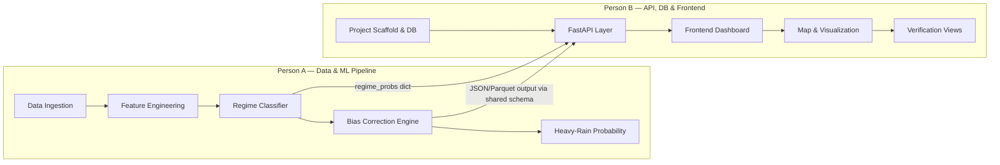

# Regime-SIH: 12-Hour Implementation Plan — Two-Person Parallel Sprint

> [!IMPORTANT]
> **Constraint:** 12 hours, 2 fullstack developers, fresh repo.
> **Goal:** End-to-end working demo — data flows from ingestion → regime classification → bias correction → API → interactive map dashboard.

---

## Architecture at a Glance



---

## Shared Contracts (Agree on FIRST — Hour 0)

Before splitting off, both devs **must** spend the first 30 minutes aligning on these interface contracts. This prevents integration pain later.

### 1. Data Schemas (Pydantic models in `shared/schemas.py`)

```python
# shared/schemas.py — both people import from here
from pydantic import BaseModel
from datetime import datetime

class RegimeOutput(BaseModel):
    date: datetime
    regime: str  # "active" | "break" | "depression" | "western_disturbance" | "normal"
    probabilities: dict[str, float]  # {regime_name: probability}

class DistrictForecast(BaseModel):
    district_id: str
    district_name: str
    state: str
    lat: float
    lon: float
    date: datetime
    lead_hours: int
    raw_precip_mm: float
    corrected_precip_mm: float
    regime: str
    regime_confidence: float
    heavy_rain_prob_65mm: float | None
    heavy_rain_prob_115mm: float | None
    category: str  # "light" | "moderate" | "heavy" | "very_heavy" | "extremely_heavy"

class VerificationSummary(BaseModel):
    regime: str
    period_start: datetime
    period_end: datetime
    rmse_raw: float
    rmse_corrected: float
    mae_raw: float
    mae_corrected: float
    ets_by_threshold: dict[str, dict[str, float]]  # {threshold: {raw: x, corrected: y}}

class GridForecast(BaseModel):
    date: datetime
    lead_hours: int
    lats: list[float]
    lons: list[float]
    raw_precip: list[list[float]]
    corrected_precip: list[list[float]]
    regime_overlay: str
```

### 2. Directory Structure

```
regime-sih/
├── shared/
│   ├── schemas.py          # ← Pydantic models (SINGLE SOURCE OF TRUTH)
│   └── config.py           # ← Paths, constants, thresholds
├── ingestion/              # Person A
│   ├── base.py
│   ├── gfs_adapter.py
│   ├── chirps_adapter.py
│   └── era5_adapter.py
├── features/               # Person A
│   ├── regime_indices.py
│   └── grid_predictors.py
├── regime_classifier/      # Person A
│   ├── train.py
│   └── service.py
├── correction/             # Person A
│   ├── quantile_mapping.py
│   └── xgboost_correction.py
├── extremes/               # Person A
│   └── heavy_rain_model.py
├── verification/           # Shared (A writes compute, B writes API exposure)
│   └── metrics.py
├── api/                    # Person B
│   ├── main.py
│   ├── routes/
│   │   ├── regime.py
│   │   ├── forecast.py
│   │   ├── verification.py
│   │   └── districts.py
│   └── dependencies.py
├── frontend/               # Person B
│   ├── src/
│   │   ├── components/
│   │   ├── pages/
│   │   ├── hooks/
│   │   └── api/
│   ├── package.json
│   └── vite.config.ts
├── data/                   # Local data cache (gitignored)
│   ├── raw/
│   ├── processed/
│   └── models/
├── docker-compose.yml      # Person B sets up
├── requirements.txt
└── README.md
```

### 3. API Endpoints Contract

| Endpoint | Method | Person B stubs immediately | Person A feeds real data into |
|---|---|---|---|
| `/api/v1/regime/current` | GET | ✅ Hour 1 | Hour 5 |
| `/api/v1/regime/history` | GET | ✅ Hour 1 | Hour 6 |
| `/api/v1/forecast/district` | GET | ✅ Hour 2 | Hour 7 |
| `/api/v1/forecast/grid` | GET | ✅ Hour 2 | Hour 8 |
| `/api/v1/forecast/heavy-rain-prob` | GET | ✅ Hour 3 | Hour 9 |
| `/api/v1/verification/summary` | GET | ✅ Hour 3 | Hour 10 |

---

## Person A — Data & ML Pipeline Engineer

### Phase A0: Project Setup + Shared Contracts (Hours 0–0.5) 🤝 *WITH PERSON B*

- [ ] Initialize git repo, create directory structure
- [ ] Write `shared/schemas.py` (Pydantic models above) together
- [ ] Write `shared/config.py` (paths, India bounding box, IMD thresholds)
- [ ] Write `requirements.txt` (xarray, cfgrib, pandas, xgboost, scikit-learn, fastapi, etc.)
- [ ] Set up `pyproject.toml` or virtual env

### Phase A1: Data Ingestion (Hours 0.5–3)

**Goal:** Get real GFS forecast data + CHIRPS observed rainfall downloaded and normalized.

- [ ] `ingestion/base.py` — abstract `DataSourceAdapter` class
- [ ] `ingestion/gfs_adapter.py` — download GFS 0.25° GRIB2 from `s3://noaa-gfs-bdp-pds/`
  - Use `boto3` (no auth needed for public bucket) + `cfgrib`/`xarray`
  - Extract APCP (accumulated precipitation) for India bbox `[6°N–38°N, 65°E–98°E]`
  - Normalize to internal schema `(time, lat, lon, precip_mm)`
- [ ] `ingestion/chirps_adapter.py` — download CHIRPS daily 0.05° from `data.chc.ucsb.edu`
  - Direct HTTP download of NetCDF/GeoTIFF
  - Regrid to 0.25° to match GFS (use `xesmf` or simple nearest-neighbor)
- [ ] `ingestion/era5_adapter.py` — download ERA5 reanalysis (MSLP, 850hPa wind, OLR, PWAT)
  - For regime indices computation
  - Use `cdsapi` with free Copernicus account
- [ ] Cache all raw data to `data/raw/` as NetCDF, processed to `data/processed/` as Parquet
- [ ] Write a simple `scripts/download_historical.py` to pull 2–3 monsoon seasons (June–Sept)

> [!TIP]
> **12-hour shortcut:** If ERA5 download is slow (CDS queue can be 30+ min), pre-download a few weeks of data in parallel while working on feature engineering. CHIRPS is instant (direct HTTP). GFS historical is fast from S3.

### Phase A2: Feature Engineering (Hours 3–5)

**Goal:** Compute regime indices from ERA5 + build predictor tables.

- [ ] `features/regime_indices.py`:
  - `compute_monsoon_trough_lat(mslp_data)` — argmin MSLP along 75–85°E, 15–30°N
  - `compute_bmi(precip_data, climatology)` — Break Monsoon Index over core zone
  - `compute_llj_index(wind_850_data)` — mean 850hPa wind over [5–15°N, 70–80°E]
  - `compute_olr_anomaly(olr_data, climatology)` — OLR anomaly
  - `fetch_mjo_index()` — parse BOM RMM text file from URL
  - Assemble into `regime_index_table` DataFrame
- [ ] `features/grid_predictors.py`:
  - Load static terrain data (elevation from ETOPO1/SRTM, coastline distance)
  - Build `grid_predictor_table`: raw NWP precip + regime probs + terrain + lag features
- [ ] `features/district_aggregation.py`:
  - Load India admin-2 boundaries (GADM shapefile)
  - Implement grid-to-district spatial averaging using `regionmask` or `geopandas`
  - Output: `district_forecast_table`

### Phase A3: Regime Classifier (Hours 5–7)

**Goal:** Train XGBoost classifier on regime indices → 5-class regime probabilities.

- [ ] `regime_classifier/train.py`:
  - Bootstrap labels using BMI thresholds (Section 4.2 rules):
    - BMI ≤ -1.0 for ≥2 days → break
    - BMI ≥ +1.0 for ≥2 days → active
    - LPS_flag = 1 → depression
    - WD_flag = 1 → western_disturbance
    - else → normal
  - Feature vector: `[BMI(t), BMI(t-1), BMI(t-2), MT_lat(t), MT_lat(t-1), LLJ(t), LLJ(t-1), OLR_anom(t), PWAT(t), MJO_phase, MJO_amp, day_of_year_sin, day_of_year_cos]`
  - Train `XGBClassifier(objective='multi:softprob', num_class=5)` with inverse-frequency class weights
  - Save model to `data/models/regime_classifier.pkl`
- [ ] `regime_classifier/service.py`:
  - `RegimeClassifier.predict(index_window)` → `RegimeOutput` schema
  - Load model from disk, run inference, return probabilities

### Phase A4: Bias Correction Engine (Hours 7–9)

**Goal:** Train regime-conditioned XGBoost corrections.

- [ ] `correction/quantile_mapping.py`:
  - Implement per-regime empirical quantile mapping as baseline
  - Two-part model: logistic for P(rain > 0), then QM on positive values
- [ ] `correction/xgboost_correction.py`:
  - Target: `residual = P_obs - P_raw_nwp`
  - One XGBoost regressor per regime
  - Feature vector from Section 5.2
  - Weighted MSE loss (α=3 for heavy-rain upweighting)
  - Probability-weighted blending across regime models (Section 5.3):
    ```
    P_corrected = Σ_k P(regime=k) · correction_k(raw)
    ```
  - Save models to `data/models/correction_{regime}.pkl`

### Phase A5: Heavy-Rain Probability + Verification (Hours 9–11)

- [ ] `extremes/heavy_rain_model.py`:
  - Binary XGBoost classifiers for thresholds 64.5mm, 115.5mm
  - Isotonic regression calibration on holdout
- [ ] `verification/metrics.py`:
  - `compute_continuous_metrics(forecast, observed)` → RMSE, MAE, Bias, r
  - `compute_categorical_metrics(forecast, observed, threshold)` → POD, FAR, CSI, ETS
  - `compute_fss(forecast_grid, observed_grid, threshold, neighborhoods)` → FSS curve
  - Run raw-vs-corrected comparison, output as `VerificationSummary` schema

### Phase A6: Integration & Data Pipeline (Hours 11–12) 🤝 *WITH PERSON B*

- [ ] Wire real model outputs into Person B's API (replace stubs with actual inference)
- [ ] Run end-to-end: GFS data → regime detection → correction → API → frontend
- [ ] Fix any schema mismatches, test live data flow
- [ ] Generate sample verification report

---

## Person B — API, Database & Frontend Engineer

### Phase B0: Project Setup + Shared Contracts (Hours 0–0.5) 🤝 *WITH PERSON A*

- [ ] Same as A0 — work together on shared schemas
- [ ] Set up `docker-compose.yml` with:
  - PostgreSQL + PostGIS
  - Redis (for API caching)
- [ ] Initialize database, create tables for districts, regime_history, verification_results
- [ ] Load India district boundaries into PostGIS (GADM admin-2 shapefile)

### Phase B1: FastAPI Backend with Mock Data (Hours 0.5–3)

**Goal:** Full API layer with realistic mock data, so frontend development is unblocked immediately.

- [ ] `api/main.py` — FastAPI app with CORS, middleware, lifespan
- [ ] `api/routes/regime.py`:
  - `GET /api/v1/regime/current` → mock `RegimeOutput` (rotate through regimes)
  - `GET /api/v1/regime/history?start=&end=` → mock timeline
- [ ] `api/routes/forecast.py`:
  - `GET /api/v1/forecast/district?date=&lead=` → mock district table with all 700+ districts
  - `GET /api/v1/forecast/grid?date=&lead=` → mock grid data
  - `GET /api/v1/forecast/heavy-rain-prob` → mock probabilities
- [ ] `api/routes/verification.py`:
  - `GET /api/v1/verification/summary?regime=` → mock metrics
- [ ] `api/routes/districts.py`:
  - `GET /api/v1/districts/geojson` → serve district boundary GeoJSON
- [ ] All routes return data conforming to `shared/schemas.py` — this is critical

> [!NOTE]
> The mock data should be **realistic** (plausible rainfall values, proper district names, reasonable probabilities) so the frontend looks convincing even before real ML outputs are wired in.

### Phase B2: Frontend Scaffold + Design System (Hours 3–5)

**Goal:** Vite + React + TypeScript app with a premium dark-mode design system.

- [ ] Scaffold: `npx -y create-vite@latest ./ --template react-ts`
- [ ] Install dependencies:
  ```
  npm install maplibre-gl react-map-gl recharts @tanstack/react-query axios
  ```
- [ ] Design system in `src/index.css`:
  - Dark mode base: `#0a0f1c` background, glassmorphism cards
  - Color palette: monsoon blues `#1e3a5f → #4fc3f7`, rain greens, alert oranges/reds
  - Typography: Inter from Google Fonts
  - Glassmorphism card styles: `backdrop-filter: blur(16px); background: rgba(30, 58, 95, 0.3)`
  - Smooth transitions on all interactive elements
- [ ] `src/api/client.ts` — Axios instance pointing at `localhost:8000/api/v1`
- [ ] `src/hooks/` — React Query hooks for each endpoint:
  - `useCurrentRegime()`, `useDistrictForecast(date, lead)`, `useVerificationSummary(regime)`
- [ ] App shell with sidebar navigation: Dashboard | Verification | About

### Phase B3: Dashboard Page — Map + Regime + Table (Hours 5–8)

**Goal:** The main operational view — this is the money shot for the demo.

- [ ] **RegimeIndicator component:**
  - Large badge showing current regime (e.g., "🌧️ Active Monsoon")
  - Probability breakdown as horizontal stacked bar
  - Animated pulse effect for high-confidence regimes
  - Glassmorphism card styling

- [ ] **DistrictMap component (MapLibre GL):**
  - Choropleth of India colored by corrected rainfall (quantile color scale)
  - District boundaries from GeoJSON endpoint
  - Click a district → popup with forecast details
  - Color scale legend
  - Regime-aware theming (subtle background color shift per regime)

- [ ] **DistrictTable component:**
  - Sortable, filterable table of district forecasts
  - Columns: District, State, Raw Precip, Corrected Precip, Correction %, Heavy Rain Prob, Category
  - Color-coded category badges (light=green, heavy=orange, very heavy=red)
  - Search/filter by state
  - Click row → highlight on map

- [ ] **ForecastTimeline component:**
  - Lead-time selector (T+6h, T+12h, ..., T+72h)
  - Regime history strip (horizontal timeline showing regime transitions)

### Phase B4: Verification Page (Hours 8–10)

- [ ] **SkillScoreTable component:**
  - Side-by-side Raw vs. Corrected metrics (RMSE, MAE, Bias, r)
  - % improvement column, color-coded green for improvements
  - Filter by regime

- [ ] **CategoricalMetrics component:**
  - POD, FAR, CSI, ETS at each threshold (light/moderate/heavy/very heavy)
  - Recharts grouped bar chart

- [ ] **FSSCurveChart component:**
  - Line chart: FSS vs. neighborhood size, raw vs. corrected
  - Dashed line at FSS = 0.5 ("useful skill" threshold)

- [ ] **ReliabilityDiagram component:**
  - Scatter + line: forecast probability bin vs. observed frequency
  - 1:1 diagonal reference line

### Phase B5: Polish + Integration (Hours 10–12) 🤝 *WITH PERSON A*

- [ ] Replace mock API responses with real data from Person A's pipeline
- [ ] Add loading skeletons and error states
- [ ] Micro-animations: card entrance animations, map transitions, number count-ups
- [ ] Responsive layout tweaks
- [ ] WebSocket stub for `/api/v1/live` (new forecast notification)
- [ ] Final end-to-end walkthrough

---

## Sync Points (Critical Meetings)

| Time | What | Duration |
|---|---|---|
| **Hour 0** | Align on schemas, directory structure, git workflow | 30 min |
| **Hour 3** | Quick check: A has data flowing? B has API stubs returning realistic mocks? | 10 min |
| **Hour 6** | Mid-sprint: A's regime classifier working? B's map rendering? Resolve blockers | 15 min |
| **Hour 9** | Pre-integration: A has correction pipeline end-to-end? B has full dashboard? | 15 min |
| **Hour 10** | 🔴 **INTEGRATION START**: swap mocks for real data, fix schema issues | Start of 2h integration block |

---

## What Gets Cut if Time is Short

Priority tiers — if you're running behind, cut from the bottom:

| Tier | Feature | Impact of Cutting |
|---|---|---|
| **Must Have** | GFS ingestion + CHIRPS + regime classifier + correction + API + map dashboard | Lose the demo entirely |
| **Should Have** | District table, regime indicator, lead-time selector | Demo works but less impressive |
| **Nice to Have** | Verification page, FSS curves, reliability diagrams | Can show metrics in terminal/notebook instead |
| **Stretch** | Heavy-rain probability model, WebSocket live updates, ERA5 full integration | Can add post-sprint |

> [!WARNING]
> **The #1 risk in a 12-hour sprint is integration failure at Hour 10.** Mitigate by:
> 1. Both people use the **exact same Pydantic schemas** from `shared/schemas.py`
> 2. Person B's mock data matches the schema perfectly — so swapping to real data is just changing the data source, not the shape
> 3. Have a working mock-data demo ready by Hour 8 as a fallback

---

## Git Workflow

```
main ← protected, always deployable
├── feature/data-pipeline     ← Person A's branch
└── feature/api-frontend      ← Person B's branch
```

- Both work on separate branches, merge to `main` at sync points
- `shared/` directory changes require both people's sign-off (schema changes break everything)
- Merge A's branch first at integration (it's the data source), then B adapts

---

## Quick-Start Commands

**Person A (Terminal 1):**
```bash
cd regime-sih
python -m venv .venv && source .venv/bin/activate
pip install -r requirements.txt
python scripts/download_historical.py   # Start data download early
```

**Person B (Terminal 1 — infra):**
```bash
cd regime-sih
docker-compose up -d   # Postgres + Redis
python -m venv .venv && source .venv/bin/activate
pip install -r requirements.txt
uvicorn api.main:app --reload --port 8000
```

**Person B (Terminal 2 — frontend):**
```bash
cd regime-sih/frontend
npm install
npm run dev   # Vite dev server on :5173
```
